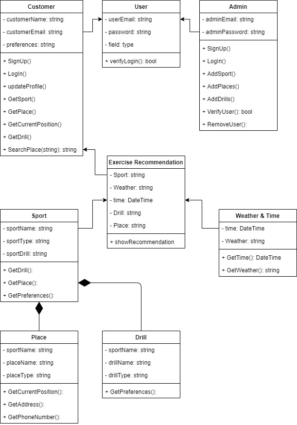

# BENET
BENET : Bringing Every Need to Exert Training
1. Nama

BENET : Bringing Every Need to Exert Training 

2. Tema 

Kesehatan/Gaya Hidup 

3. Konsep 

● Konsep inti: 

  Rekomendasi olahraga keseharian 

● Kerja: 

  -Rekomendasi olahraga = Perkiraan cuaca, Rekomendasi jam olahraga, Saran 
tipe olahraga, Saran jenis olahraga, Rekomendasi durasi olahraga. 

  -Lokasi = User input olahraga, Lokasi user, Pencarian tempat olahraga, Saran 
tempat olahraga dan yang bisa dihubungi serta harga sewa tempat. 

  -Rekomendasi diet = (To Be Determined) 

  -Mencari teman olahraga = (To Be Determined) 

4. Tipe 

Berbasis mobile app berbasis Xamarin dengan Accu Weather API dan Google Map 
API. 

5. Github Repository 

https://github.com/adhyaksazhalifunnas/BENET

6. Domain Diagram

7. Penjelasan BENETproto

BENETproto merupakan prototype dari BENET dikarenakan kurangnya pengetahuan team dalam xamarin. BENETproto dibuat pada Visual Studio menggunakan Windows Forms App (.NET Framework), dimana BENET direncanakan untuk menggunakan xamarin [Mobile App (Xamarin.Forms)]. Masih dirundingkan untuk merubah Xamarin.Forms menjadi WebApplication dikarenakan kurangnya pengalaman team dalam menggunakan xamarin dan pengalaman menggunakan WebApplication.
